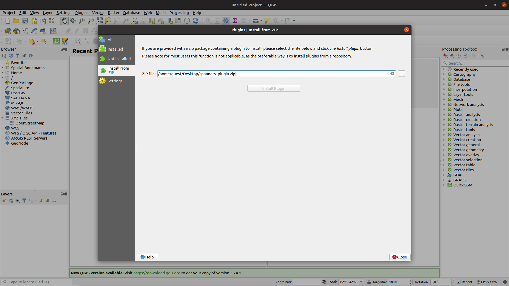

# Using Git

Following this installation guide, you will use our git repository to install frontend and backend on your device. To install the backend, you can also follow the [installation guide using Docker](./docker.md) instead.

## Install Frontend

The frontend can be installed on Linux and Windows. The following sections list all necessary requirements and installation steps depending on the operating system.

### Requirements

Following technologies are needed to install the frontend on your system:

- [QGIS(3.X)](https://qgis.org/en/site/index.html)
- protobuf(>=3.17)
- pybind11(>=2.7.1)

The installation steps below describe how to install these requirements on the respective system. There is also the possibility to install the frontend from a .zip file. This option simplifies the installation and does not require any installation tools.

### Install from ZIP
The frontend can be installed easily from a .zip file which can be downloaded from this link. Otherwise it is possible to create the zip file from the source code, but this requires the QT-develop tools and the requirements mentioned above. The .zip file can be created by the `make zip` command called from the root of the cloned plugin directory.

The .zip file can be installed in QGIS from the menu bar under  
`Plugin -> Manage and Install Plugins... -> Install from ZIP`. This is what the window looks like:

<a name = "createGraph">
	{:target="_blank"}
</a>

Probably, you need to install the Python packages via the OSGeo4W shell by navigating to the frontend directory with  
`cd C:\Users\<User>\AppData\Roaming\QGIS\QGIS3\profiles\default\python\plugins\<plugin_name>` and executing `python3 -m pip install -r requirements.txt`.

Subsequently, you can [install the backend](./git.md#install-backend) or connect the frontend to an existing backend server.

__Note:__ The .zip file does not provide binaries for the shortest path raster analysis. This would lead to a worse performance, because a pure Python implementation would be used instead. If you want to improve the performance of this analysis, you have to compile the C++ sources as described below in the respective installation instructions.

### Linux
The installation of the plugin under Ubuntu 20.04 (Focal Fossa) does not work, as QGIS crashes when importing Google's protobuf python modules on this operation system. From Ubuntu 21 the import works and the plugin can be installed.
First, if they are not already on your system, install these prerequisites for the following steps:

- __`autoconf, automake, libtool, make, g++` and `unzip`:__ Install those by typing `sudo apt-get install autoconf automake libtool curl make g++ unzip` so you will be able to use protobuf.
- __Python__ should be installed on your Linux by default, but if it isn't, type `sudo apt-get install python3` to install it. Make sure you really have access to Python __3__.

Please follow the instrcutions below to install the frontend on Linux:

- [Install QGIS](https://qgis.org/en/site/forusers/alldownloads.html#linux) on your system.
- The __protobuf compiler__ is needed to compile the necessary protocol files. At first, you will need to download the `release .tar.gz` or the `.zip` package. To do so, download the file `protobuf-cpp-3.17.3.tar.gz` or `protobuf-cpp-3.17.3.zip`, respectively from . Unpack it at a location of your choice. Open your terminal in the root of that folder and type `./configure`. After that, run this command: `make check`. Unfortunately, it is possible for the command to fail here and there, but that does not have to be relevant for this application. According to experience, a successful usage of the plugin is possible even when the first protobuf test should fail.
Next, run `sudo make install`. To finish the protobuf's installation, run `sudo ldconfig`. At this point, you don't have to expect any output. 
If you want, you can also see  for the official installation instructions.
- Clone the repository: `git clone --recursive <frontend-repository>`. Make sure to clone it recursively so that the submodules are loaded.
- The required python packages can be installed with the `pip -r requirements.txt` command called from the root directory.
- Deploy the plugin to QGIS by calling the `make deploy` command in the root directory. The plugin is now located on Linux at  
`/home/<user>/.local/share/QGIS/QGIS3/profiles/default/python/plugins`  
__Alternative:__ Copy or clone the repository directly into the folder located at `/home/<user>/.local/share/QGIS/QGIS3/profiles/default/python/plugins`. After copying, you need to navigate to the root of the frontend directory and execute the commands `make proto`, `make transcompile` and `make pybind\_build`. The `pybind\_build` is optional, but recommended as it speeds up the shortest path raster analysis using compiled C++ binaries. This command needs a C++ compiler on your system.
- Finally, the plugin needs to be enabled in QGIS: `Plugins -> Manage and Install Plugins...`

Subsequently, you can [install the backend]((./git.md#install-backend)) or connect the frontend to an existing backend server.

### Windows
The following instructions describe how to install the frontend on Windows:

- Install Git with [Git Bash](https://gitforwindows.org/). Alternative for Git Bash: [Cygwin](https://cygwin.com/)
- Install QGIS via [OSGeo4W Network Installer](https://qgis.org/en/site/forusers/download.html#windows). In the installation wizard, choose `Advanced Install` and then select `qgis` and/or `qgis-ltr` in the desktop section and the `qt5-devel` package in the libs section. The "qt5-devel" package is needed to compile translation files. It is also possible to install this package separately via this installer if a QGIS installation already exists.
- Add `C:\OSGeo4W\apps\Qt5\bin` and `C:\OSGeo4W\bin` to the environment variable `PATH`. This tells the system where the executables of the qt tools are located.  
__Note:__ The installation directory can differ on your system. If this is the case, please enter the right directories in the commands above.
- [Install protobuf compiler](https://github.com/protocolbuffers/protobuf/blob/master/src/README.md#c-installation---windows) on your system. The simplest way is to [download the protoc binary](https://github.com/protocolbuffers/protobuf/releases/tag/v3.19.1) and either add the absolute path of `protoc-3.19.1-win64\bin` to the environment variable `PATH` or replace `protoc` in the Makefile by the absolute path of `protoc-3.19.1-win64\bin`.
- [Install Visual Studio](https://visualstudio.microsoft.com/de/vs/features/cplusplus/) for the C++ compiler. This compiler is optional, but recommended if you want to enhance the speed of the shortest path raster analysis using compiled C++ binaries.
- Clone the repository with `git clone --recursive <frontend-repository>` in the Windows shell or Git Bash. Make sure to clone it recursively so that the submodules will be loaded.
- Open OSGeo4W Shell and navigate to the frontend directory with `cd <path_to_dir>`. Execute the following commands:
    - `python3 -m pip install -r requirements.txt` to install the required python packages.
    - `python3 scripts/setup.py build_ext --build-temp build_tmp/ --build-lib lib/`. This command builds the C++ binaries, is optional and can only be executed if a C++ compiler is installed. The created `build_tmp` can be removed afterwards, e.g. with `rmdir build_tmp`.
- Install the package manager [chocolately](https://chocolatey.org/) on your system. Run `choco install make` in a windows shell to install GNU make.
- Open Git Bash (or Cygwin) in the frontend directory and execute the following commands in the shell: 
    - `make transcompile`
    - `make proto`  
__Note:__ make deploy does not work on windows, because the environment variable `HOME` in the Makefile is not set correctly in Git Bash (also in cygwin).
- Copy the frontend directory to  
`C:\Users\<User>\AppData\Roaming\QGIS\QGIS3\profiles\default\python\plugins`.  
__Note:__ The QGIS directory can differ on your system. Alternatively, you can manually zip the cloned frontend directory and install it as described above.
- Activate plugin in QGIS: `Plugins -> Manage and Install Plugins...`

Subsequently, you can install the backend or connect the frontend to an existing backend server.

## Install Backend
The backend contains a server and is needed to run algorithms on the graphs. It is possible to use the frontend without a server, but the graph algorithms are not available in this case. 

The backend can be installed directly on a Linux system (see below) or the server can be [run in a Docker container](./docker.md), which automates and simplifies the complex installation of the system. The recommended way is to use Docker which __also supports Windows__.

### Linux
The requirements and instructions below describe how to install the Backend locally on a Linux system.

The system requires the following technologies:

- [Protobuf (>= 3.17)](https://github.com/protocolbuffers/protobuf#protocol-compiler-installation)
- [PostgreSQL](https://www.postgresql.org/)
- [boost (>= 1.71)](https://www.boost.org/)
- [cmake (>= 3.16)](https://cmake.org/)
- [pqxx (>= 7.5)](http://pqxx.org/development/libpqxx/)
- [asio (>= 1.18)](https://think-async.com/Asio/)
- [OpenSSL dev library (>= 1.1.1)](https://www.openssl.org/)

The protobuf compiler used in the frontend installation can be used here as well. The installation steps of pqxx are provided in the instructions below.

- __PostgresSQL__ In most cases PostgresSQL is already installed on your system. If not, run this command: `sudo apt-get install postgresql`.
- __boost__ The boost library can be installed with this command: `sudo apt-get install libboost-all-dev`
- __cmake__ With high probability, cmake is already installed on your system. If not, use Ubuntu's software manager and install `CMake (Cross-platform buildsystem)`. To verify your installation, you can type `cmake -{}-version` in any terminal.
- __asio__ To install the asio C++ library, you can type this command: `sudo apt-get install -y libasio-dev`
- __OpenSSL dev library__ The OpenSSL development library can be installed with `sudo apt-get install libssl-dev`.

Please follow the following instructions to manually install the backend server:

- Clone the repository with submodules: `git clone --recurse-submodules <backend-repository>`
- Install pqxx library manually: 
    - Clone from the [source from Github](https://github.com/jtv/libpqxx)
    - Run following commands in the root directory:
        - `git checkout 7.5.2`  # or other version number
        - `./configure --enable-shared`
        - `make`
        - `sudo make install`
- Setting up the database:
    - To create a superuser, first open the postgresql shell: `sudo -u postgres psql`. Alternatively, use the _createuser_ command.
    - Execute the following commands in the shell:
        - Create a user: `CREATE SUPERUSER spanner_user WITH PASSWORD pwd;`
        - Create a database: `CREATE DATABASE spanner_db;`
        - Close postgresql shell: `\q`  
        __Note:__ On Arch-systems (and possibly other systems) you might need to initialize postgres and start the postgresql service: `initdb -D /var/lib/postgres/data`
    - To insert tables into the database, run `psql spanner\_db < database/spanners_tables.pgsql` in the root directory of the backend.  
    Alternatively, you can open the database in the postgres shell by typing `psql spanner_db`. Then you can copy and run the code from `database/spanners_tables.pgsql` in this shell. The created tables can be listed by the `\dt` command.
- The server can be compiled and run either with or without TLS encryption:
    - Server with TLS encryption
        - The compiling with TLS enabled requires a signed certificate and a key file in PEM encoding. Compile the server with TLS by running these commands in the root directory:
            - `mkdir build`
            - `build`
            - `cmake ..`
            - `make -j8`  # -j8 specifies your number of parallel cpu cores
        - __Note:__ The application accepts two command line arguments:
`./apps/server <certificate-path> <key-path>`
    - Server without TLS encryption
        - The server can be build without TLS encryption, e.g. for local use.  Compile the server without TLS by running these commands in the root directory:
            - `mkdir build`
            - `build`
            - `cmake -DUNENCRYPTED\_CONNECTION=ON ..` # disable encryption
            - `make -j8`  # -j8 specifies your number of parallel cpu cores
        - __Note:__ Running the server application without TLS does not require any command line arguments.
- Run the server in the built directory: `./apps/server`. The server is now reachable under `localhost:4711`.
