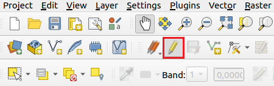
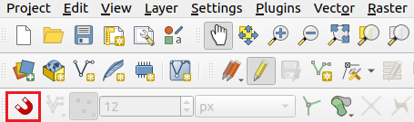
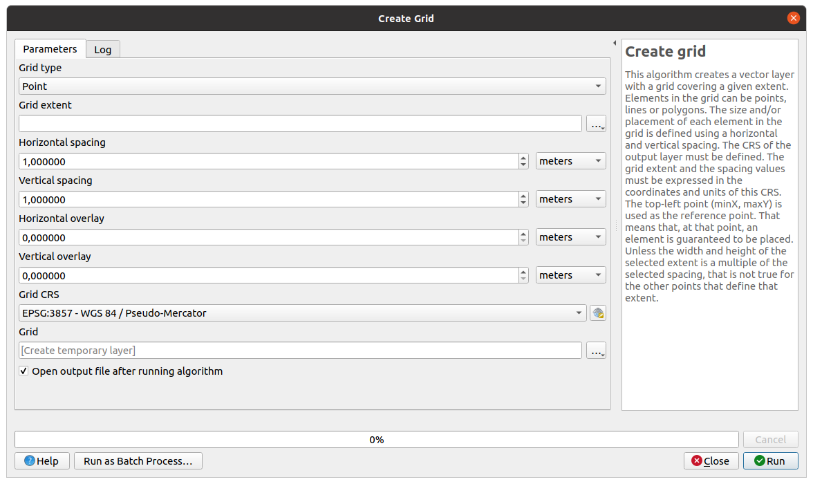
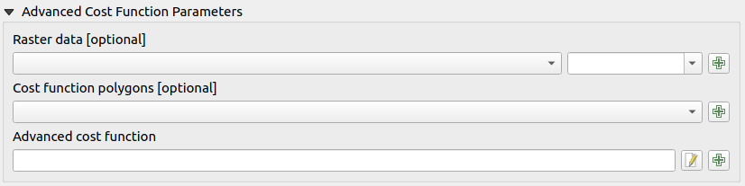
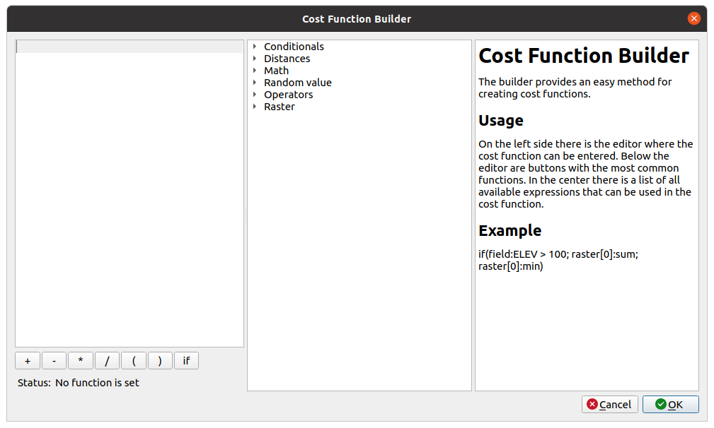
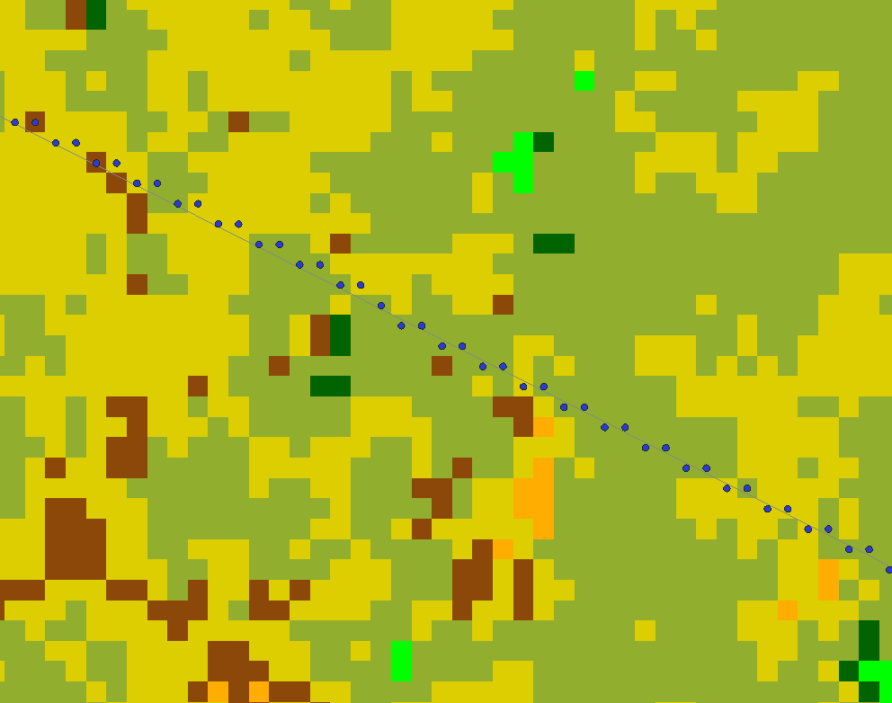
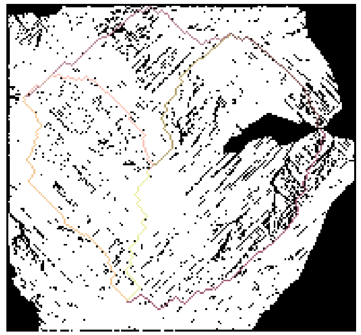

# Graph Builder

As the main field of use for the plugin is creating graph instances, the following sections will explain how to use the plugin to create such graphs. 

The figure below shows the user interface for the graph creation process which you can access in our OGDF-Plugin by accessing the _Create graph tab_.
Different areas are highlighted and referenced throughout the following sections.

<a name = "createGraph">
	[](https://project2.informatik.uni-osnabrueck.de/spanners/img/Plugin_CreateGraph.png){:target="_blank"}
</a>

<!--- TODO: richtige Links für vector layer etc finden  --->
<!--- TODO: Cost Function Window schräg?  --->

<!--- TODO: OGDF-Plugin?  --->

## Vector Layer
You can add a vector layer at the top of area 1. It's possible to use line layers and point layers, or you can choose to recreate a graph from the set of available file formats (see the [Graph Export section](./graphlayer.md#graph-export)). If you insert a line layer, every end point of a line will be a graph vertex and an edge is inserted between connected points. If you insert a point layer, the points will be vertices in the graph, but no information about the connection is available. This is why you have to define a _connection type_ in area 3. All the different _connection type_ options will be explained in the [according section](#connection-type).
By using  a line layer as input, you can also draw your own graph on the [QGIS-Canvas](https://docs.qgis.org/3.16/en/docs/pyqgis_developer_cookbook/canvas.html) or create a variety of different special types of graphs. For the latter, you need to use a set of QGIS-tools you can select from the [Processing Toolbox](https://docs.qgis.org/3.4/de/docs/user_manual/processing/toolbox.html) directly in QGIS. 

## Random Graph
If you don't want to use a vector layer as basis for the graph, it's possible to use a set of random vertices instead by checking the ```Random graph``` checkbox in area 1. In area 2 you can define different additional properties of the random points, such as the number of vertices and the area in which the vertices should be placed. There are some predefined possibilities for the area, but you can define your own custom area as well. 

The last option for a random graph is an optional seed you can provide in order to replicate past results.
The seed of an existing graph can be seen in the _graph layer window_ of the corresponding graph layer. The [coordinate reference system (CRS)](https://docs.qgis.org/3.16/en/docs/training_manual/processing/crs.html) of the created `GraphLayer` is set to ```EPSG:4326``` by default. The CRS is changed by defining your own custom area. In this case, the CRS is set to the project-CRS. 

## Connection Type
If you use a point vector layer or random points as basis for the graph, you need to choose how you want to connect these points. The following list shows all available options for the _connection type_.


- **```Nearest Neighbor```:** Connects every vertex to its nearest points. You can define the number of neighbours in area 3. Additionally, it's possible to allow double edges by selecting the checkbox in area 3 next to the number of the ```Nearest Neighbour``` field.
As the name suggests, this allows the existence of edges going into both directions. If this option is enabled, a graph with 10 vertices and 3 nearest neighbours has 30 edges. If the option is disabled, the amount of edges is smaller because it's not possible to find the given number of neighbours for the last vertices. Note that the resulting graph differs depending on your setting of the edge direction in area 4. If you select ```directed```, the amount of edges will be higher than in case of undirected edges. This is because
in the undirected case, no edges will be inserted for a node which already has the desired amount of edges. Another thing to keep in mind is that a directed graph is acyclic whenever you did not allow double edges because for every processed node, only outgoing edges are inserted and afterwards the node is no longer considered, so no entering edge can be inserted.
- **```Complete```:** Connects every pair of vertices to a fully connected graph. Note that the graph is different depending on your setting of the edge direction in area 4. The amount of edges will be twice as high if you select ```directed``` because every edge is inserted into both directions which leads to a higher memory consumption and to a longer creation process. 
- **```ClusterComplete```:** Creates a set of clusters. In area 3 you can define the amount of clusters. Every vertex inside the same cluster is connected with every other vertex in the same cluster. As with the normal complete graph, the graph is dependent on the setting of the edge direction in area 4. 
- **```ClusterNN```:** Creates a set of clusters. Every vertex is only connected to vertices in the same clusters. In contrast to the ```ClusterComplete``` connection, every vertex is connected to its nearest neighbours. For this reason, all the options for the ```Nearest Neighbor``` connection apply. 
- **```DistanceNN```:** Connects every vertex to every other vertex, which is in a specified distance to the vertex. You can define this distance in area 3. It's possible to set the distance in different units. If the CRS of the input vector layer uses degrees as units, the only unit possible is degrees. In case the input layer uses meters, you can choose from 8 different units. You can again allow double edges.
- **```Random```:** Creates random connections. You can specify the amount of random edges in area 3. It's possible for a directed graph that reciprocal edges exist. This is
not possible for an undirected graph.
- **```LineLayerBased```:** The idea of this connection type is to connect the vertices based on the topology of a given line layer. You can provide this line layer in area 3. In
addition to this you have to provide a maximum distance in the ```Distance``` field in area 3. For the vertex connection first all lines within this distance are calculated. If
you set this distance to 0, the nearest of all lines is taken into account. An exception is a vertex which is placed exactly on top of multiple lines. In this case all of these lines
are taken. The vertices are connected through the use of a depth-first search procedure, which is executed on the graph created by the provided line layer. Next to the 
```Line layer``` field you can specify a threshold value. During the creation process, a small threshold value will speed up the process, but some neccesary connections might not be
made. If you want to export the graph to `.graphml`, you should check the ```Create feature infos``` checkbox. This will enable you to export all the feature attributes into the
`.graphml file`.


## Drawn Graphs and Grid Graphs

You can use QGIS to draw your own graph on the Canvas and you can use our tool to create special types of graphs like
grid graphs.

#### Draw Your Own Graph
To start with, go to ``` Layer -> CreateLayer -> New Shapefile Layer ```. In the window, select ```LineString``` as geometry type, a file name and a CRS. Next, you have to turn on the editing mode by clicking on the ```Toggle Editing``` button in the _toolbar_. The button is
highlighted in the image below: 

<center>    
<a name = "toggleEditing">
	[](https://project2.informatik.uni-osnabrueck.de/spanners/img/Toggle_Editing_Selection.png){:target="_blank"}
</a>
</center>

After this, you should enable the ```Snapping Toolbar``` by checking ```View -> Toolbars -> Snapping Toolbar ```, which enables you to connect endpoints of lines. This gives you the button highlighted in the figure below:

<center>
<a name = "SnappingTool">
	[](https://project2.informatik.uni-osnabrueck.de/spanners/img/SnappingTool.png)
</a>
</center>

<!--- TODO: gehört der Punkt nach strg+ wirklich da hin? --->


To insert additional lines you can use ```Strg+.``` or click the ```Add Line Feature button``` in the _toolbar_. Then you can insert lines by left-clicking and ending a line segment by right-clicking. This enables you to create arbitrary graphs or to modify existing
line layers.

#### Create a Grid Graph

A grid graph is a graph in which every vertex is connected to its four neighbouring vertices and the distance between every pair of connected vertices is the same. You can create such a graph by first selecting the ```Create Grid tool``` from the _Processing Toolbox_. This opens the window shown in the following figure:

<center>
<a name = "CreateGridWindow">
	[](https://project2.informatik.uni-osnabrueck.de/spanners/img/Create_Grid_Window.png){:target="blank"}
</a>
</center>

You can see that the selected CRS in this window is ```EPSG:3857```. You should choose this or another CRS that uses meters as its metric if you wish to select the horizontal and vertical spacing in meters or kilometers. Select ```Point``` as _grid type_, enter the desired spacing and choose an extend for the grid. Make sure that the extend and the spacing match correctly. Use this point set as input for the vector layer and choose ```DistanceNN``` as _connection type_. You have to enter the selected spacing and add a small number to it. Select this value
as the distance.

## Additional Connection Parameters

There are two additional connection parameters in area 5. Both of them are optional parameters that offer the opportunity to give additional information to modify the initial graph created with all the other parameters. 

First, it's possible to set _Forbidden areas_. You have to specify these areas as a polygon layer. All the edges crossing a bound of at least one of the polygons get deleted. This means that the resulting graph has no edges crossing these polygons. 

The second option is called _Additional point layer_. You can give additional points which you want to insert into the graph if you selected a line layer as basis for your graph. This way you can define some additional points of interest which were not included in the original line layer. A newly inserted point is connected to the graph by creating one edge to the nearest vertex already contained in the graph. 

## Distance Strategy

Through the distance strategy, you can define the calculation of the edge costs. You can choose from 4 basic distances or you can choose to apply an [advanced distance strategy](#Advanced-Distance-Strategy). The 4 basic strategies are ```euclidean```, ```manhattan```, ```geodesic``` and ```ellipsiodal```. You can see the formulas for the distance calculation between two points \(x_1,y_1\) and \(x_2,y_2\) below. The formula ```euclidean``` defines the euclidean distance, ```manhattan``` the manhattan distance and ```geodesic``` 
the geodesic distance. 

**Euclidean:**
$$d_{eucl} = \sqrt{(x_1 - x_2)^2 + (y_1 - y_2)^2}$$
**Manhattan:**
$$d_{man} = |x_1 - x_2| + |y_1 - y_2|$$
**Geodesic:**
$$d_{geo} = 2 \cdot 6371000 \cdot arcsin(\sqrt{sin^2(\frac{x_2 - x_1}{2}) + cos(x_1) cos(x_2) sin^2(\frac{y_2 - y_1}{2})})$$

 Note that the geodesic distance is only applicable for a geographic CRS as it uses a sphere and is calculated by the _Haversine Formula_.

The formula for the ellipsoidal distance is not listed because this distance is calculated by QGIS and is different for every CRS. QGIS however, does not support the calculation of this distance for all CRS. So it's possible that the use of this formula leads to not calculated distances for some CRS.

## Advanced Distance Strategy
This option enables you to define your own custom cost function by submitting a formula. This cost function formula has to be in line with our specific syntax. After you specified the formula, it is translated into numbers for the edge costs. This enables you to freely specify a variety of cost functions and model real world scenarios. This section will explain all of the expressions you can use and the syntax/restrictions of our modeling language.

If you select ```Advanced``` as distance strategy, new fields appear. You can see these fields in the figure below. In the first two lines you can provide any number of raster or respectively polygon layers. These layers can later be used in the specification of the cost function formula.

<center>
<a name = "AdvancedParameters">
	[](https://project2.informatik.uni-osnabrueck.de/spanners/img/Plugin_CreateGraph.png){:target="_blank"}
</a>
</center>


In the ```Advanced cost function``` text field you can insert the formula for the cost function. This can directly be inserted into its corresponding field or you can click the ```edit``` button next to the field to open a widget, which makes the creation process easier by showing all available expressions. You can see this widget in the image below:

<center>
<a name = "AdvancedWigdet">
	[](https://project2.informatik.uni-osnabrueck.de/spanners/img/Advanced_Widget.png){:target="_blank"}
</a>
</center>

In this widget you can insert the formula into the text field on the left. In the middle there is a tree view which shows all the available expressions you can use to build your cost function. The field on the right shows additional information about a selected expression. You can insert an expression by double-clicking it. This already gives you an idea of the syntax associated with an expression. 

The next paragraphs show and explain all of the expressions and operators. Note that the complete formula is case sensitive.

#### Operators
You can use \({+, -, *, /}\) as operators in the formula to add, subtract, multiply or divide expressions and variables. You can also use round brackets to structure your formula and insert spaces freely.

#### Math
You can access all of the available math operators in the tree view. Just insert ```math.``` followed by the
desired math operator and set the parameters needed in round brackets. Note that only math operators with one or two parameters are supported. If the math expression requires two parameters separate them with a comma.

#### Normal Distances
You can insert the four basic distances into the formula by simply typing ```euclidean```, ```manhattan```, ```geodesic``` or ```ellipsoidal```. You can also use shortest path distances in connection with a raster layer, which are described in the paragraph about [raster analysis expressions](#Raster-Analysis).

#### Vector layer fields
You can select all the field information of the underlying vector layer which contain numbers. To insert these numbers into the formula, just insert ```field:``` followed by the field name. If the underlying vector layer contains lines, the number is assigned directly to the appropriate edge in the graph. You can also use field information if you use a point layer as input. In this case, an edge is appointed the field information of the edge endpoint. 

#### Random
The _random expression_ allows you to introduce randomness into the cost function. The syntax looks like ```random(LB,UB)```, where _LB_ is the lower bound and _UB_ is the upper bound. Both bounds are inclusive. For example, if you insert ```random(1,100)```, this results in random edge costs between 1 and 100. If at least one of the bounds is a floating point number, the resulting edge weights will be floating point numbers as well.

#### Raster Analysis
There are a lot of different ways to use raster layers in the cost function definition. To address a specific raster layer you selected before, enter ```raster[index]```. Note that you can only access a raster layer that you inserted into the field you can see in the image on [Advanced Parameters](#AdvancedParameters) above. For example, to access the second raster layer you selected, enter ```raster[1]```. After that, you can select an analysis type for the raster layer. 

You can see all the analysis options in the tree view of the [Cost Function Window](#AdvancedWigdet). The type names are self-explanatory. Nevertheless, you can see a short description in the _Cost Function Window_ if you select an analysis. Before you enter the analysis type, enter a ```:```, for example ```raster[0]:sum``` which adds up all the pixel values. 

As you can see in the tree view of the [Cost Function Window](#AdvancedWigdet), every analysis is listed with and without a ```sp``` prefix. If you do not include this prefix, all pixel values an edge is crossing are included. 

You can see a visualisation of the included pixels for one edge in the image below:


<center>
<a name = "PixelsCrossed">
	[](https://project2.informatik.uni-osnabrueck.de/spanners/img/Pixels_Crossed.png){: style="height:400px", :target="_blank"}
</a>
</center>

If you insert the prefix, a shortest path algorithm is executed to find the cheapest path through the pixels. 
The algorithm is started for every edge with the edges' two endpoints. All pixel values of this shortest path are included. You can create a visualisation of all the shortest paths by checking the ```Show Shortest Path View``` checkbox located in area 5 under the text field for the formula which appears if you insert a shortest path expression at some point. 

You can see such a visualisation below:

<center>
<a name = "ShortestPath">
	[](https://project2.informatik.uni-osnabrueck.de/spanners/img/Shortest_Path_View.png{: style="height:450px", :target="_blank"}
</a>
</center>

All pixels that were visited by the algorithm are white. All pixels that the algorithm did not visit are black. The shortest paths are marked in different colours. To use a raster analysis in connection with the shortest path, you have to specify an heuristic index between 0 and 5. You can do this by inserting it in round brackets after the analysis type. For example, you could enter ```raster[0]:spMean(3)``` to execute the shortest path analysis on the first raster layer and a heuristic index of 3. This would result in a mean value of all the pixels on this shortest path. 

It's important to know that the shortest path is only guaranteed to be exact if the heuristic index is set to 0. There exists a trade-off between the accuracy of the shortest path and the execution time. Basically, if you increase the index, the execution time gets smaller and the result gets more inaccurate. 

There are four special cases of raster analysis which are described in the paragraph about [if conditions](#if-Condition) because they can only be used in an if condition. You can also get information about the distance of the shortest path by inserting the ```sp``` prefix in front of one of the distance metrics. For example, ```raster[0]:spEuclidean(0)``` calculates the euclidean distance of the shortest paths with a heuristic index of 0. Note that this distance can only be as accurate as the resolution of the raster layer and that the calculation assumes that the pixel height and width are identical. It will lead to inaccurate results if this is not the case.

#### if Condition

You can use the ```if``` expression in order to test whether a specified condition is true or not and to change the cost function
accordingly. <br />The syntax you need to use looks like this: ```if(condition; result_{true}; result_{false})```. 

The condition has to be some kind of check, like ```10 < 20```. You can also combine conditions, like ```10 < 20 and 20 < 30```. As comparison operators you can use ```<,>,<=,>=,!=,==``` and as connections between conditions you can use ```and, or```. After the first semicolon, you can specify what the ```if``` expression should translate to if the condition is true and after the second semicolon, you can define what it should translate to if the condition is false. 

An example for a complete if expression is ```if(euclidean < 100; 10; 20)```. In this example the weight of an edge is set to 10 if the euclidean distance between the end points is less than 100 and to 20 if not. 

There are a total of 6 expressions that can only be used in the condition of an if expression. The first two refer to polygon layers you can specify in the field you can see in the image on [AdvancedParameters](#AdvancedParameters). You have the possibility to test whether an edge crosses a polygon of a specific polygon layer or to test whether it lies inside one. To identify the polygon layer you wish to use, enter ```polygon[index]``` with index referring to the place the layer was inserted. For example, ```polygon[2]``` refers to the third polygon layer you inserted in the field. After that, you have to type a ```:``` followed by either ```crossesPolygon``` or ```insidePolygon```. This polygon expression will be translated to ```true``` or ```false```. For example, you can insert the formula 
```if(polygon[0]:crossesPolygon == True; 10; 20)``` to set all the edges crossing a polygon of the first inserted polygon layer to 10 and all other edges to 20.
 
The other 4 expressions refer to raster layers. First you have to specify the raster layer. After that, insert again a ```:```, followed by ```pixelValue``` or ```percentOfValues```. Similar to the shortest path options described in the previous paragraph, you can use the ```sp``` prefix in front of these two identifiers to use the shortest path pixel values instead of the pixels which are crossed by the edge. You can use ```pixelValue``` to test if at least one of the pixel values fulfills the condition. For example, the condition ```raster[0]:pixelValue == 100``` checks if at least one pixel value is equal to 100. If you use the ``` sp``` prefix, you have to give the heuristic index in round brackets again. Use ```percentOfValues``` to test if a specified percentage of the pixel values satisfy the condition. You can declare this percentage in round brackets. For example, the condition ```raster[0]:percentOfValues(50) > 100``` tests whether 50 percent or more of the pixel values are greater then 100. If you use the ```sp``` prefix, you have to specify two values in the round brackets, separated by a comma: First the heuristic index for the shortest path algorithm and second the percentage. For example, ``` raster[0]:spPercentOfValues(3,50) > 100```, with 3 being the heuristic index and 50 being the percentage. 

#### Examples

All the examples above are very simple expressions. You can also combine all the expressions to form more complex ones. 
In the following, a list of examples is given, starting from very simple ones to more complex examples. An explanation is provided for every formula as well. Not all of the formulas make sense to use. The examples should only outline the basic capabilities of the system.

| Cost Function | Description |
| ------------ | ------------- |
| ```42```              | Constant cost of 42 for every edge|
| ```math.pow(10, 2)``` | Evaluates to \(10^2 = 100\)        |
| ```field:maxspeed * euclidean``` | Accesses the maximum speed information of a line layer |
| ```math.ceil(manhattan * random(0.1, 1.5))``` | Uses the ceil function to round up the value in the <br />brackets. For the calculation of the value, multiply <br /> the manhattan distance with a random floating point <br /> value between 0.1 and 1.5 |
| ```if(raster[0]:spEuclidean(0) < 3*euclidean;raster[0]:spSum(0);raster[0]:sum)``` |Sets the cost of an edge to the sum of the raster pixels <br /> of the shortest path if the euclidean distance of the <br /> shortest path is not 3 times longer then the <br />direct euclidean distance. If the shortest path is <br />too long then the cost is set to the normal sum <br />of the pixel values |
| ```if(raster[0]:spEuclidean(0) < random(1,5) * euclidean; math.cos(raster[0]:spSum(0) + random(euclidean, manhattan)); math.sqrt(raster[0]:sum))``` | Similar to the previous example, but some embedded <br /> random and math functions|
| ```random(if(polygon[0]:crossesPolygon == True; euclidean; manhattan), if(polygon[0]:insidePolygon == True ;euclidean*2;manhattan*2))``` |Calculates a random value. The upper and lower bound <br />are dependant on the evaluation of two if expressions<br /> which use polygon expressions in their conditions|


### Limitations and Syntax Check

You can only nest all the expressions freely as long as you don't nest the same expression. So for example it's not possible to create a formula ```random(random(10,20),100)```. Another limitation exists due to the fact that you can not negate any variable, since there has to be a variable on each side of an operator. So for example ```-euclidean``` is not possible.
As a workaround you can use ```0-euclidean```.

To make it easier for you to specify the formula, a check is performed constantly as you type in your cost function. You can see the result of this syntax check below the text field for the cost function in the _Cost Function Window_. Additionally to a brief description of the problem, the part where the problem is located is highlighted as well. 

Unfortunately, the coverage of this syntax check is not at 100 percent, so there are some cases where the syntax check is not able to recognise the mistake in the formula. This problem occurs mainly with simple typing errors, which should always be easy to correct if the graph creation process should fail/terminate.
