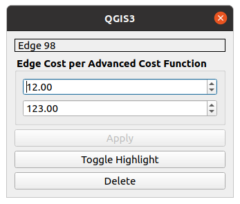
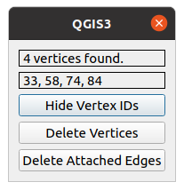

# The Graph Layer

The graph layer allows you to visualize the graph you created using the [Graph Builder](graphbuilder.md). Several options are given to help increasing the [visibility of the graph](#visualization-options). In addition to that, the _Graph layer window_ enables you to [edit the graph](#graph-editing) after creating it. The graph and your adjustments on it can be saved to your QGIS-Project or you can [export](#graph-export) it to a [`QgsVectorLayer`](https://qgis.org/pyqgis/master/core/QgsVectorLayer.html) (which is simply called _vector layer_ in the following) or to a vector file.
Note that the graph layer is based on a [`QgsPluginLayer`](https://qgis.org/pyqgis/master/core/QgsPluginLayer.html) so it does provide its own functionality independent from possibly existing operations for a vector layer. The _Graph layer window_ contains some basic information about your created graph in addition to an UI. It can be opened by double-clicking the layer in the _layer browser_. Note that this window replaces the default properties window of e.g. a vector layer. This is the _Graph layer window_:

    <a name = "GraphLayerWindow">
        {:target="_blank"}
    </a>

## Graph Information
The _Graph layer window_ shows all relevant information of your graph or graph layer in one place. This information consists of name, vertex count, edge count, coordinate reference system and all settings done by the graph builder. The last mentioned data can be useful when working with random graphs especially if you want to edit them by hand after creating them initially.

## Visualization Options
Directly below the general information, the _Graph layer window_ offers several buttons to toggle some visual properties of the graph.

#### Zoom to Layer
The canvas included in a QGIS window allows you not only to see your added layer but also to move it around, zoom in and zoom out. This button resets the canvas to include the whole graph.

#### Toggle Rendering
This button toggles the complete rendering process of the graph, making it invisible if disabled. This operation is very similar to the `visibility` checkbox in the layer browser which also disables or enables the rendering of a layer.

#### Toggle Lines
Depending on the density of your graph, a lot of edges may be overlapping and eventually resulting in an unclear graph picture. This button toggles the visibility of all edges/lines. For very large graphs this might improve the renderer's performance.

#### Toggle Edge Text
If the graph's edges are visible, this button toggles the visibility of the attached edge costs.

#### Toggle Direction
If the graph's edges are visible, this button toggles the visibility of the edge directions. Represented by red arrow heads, the edge direction can be of help for the graph editing described in the [next section](#graph-editing).

#### Choose Cost Function
As shown in the section regarding [advanced distances](./graphbuilder.md#advanced-distance-strategy), you can add multiple _advanced costs_ to your graph and its edges. As mentioned before, only one edge text and therefore only one edge cost is visually attached to a line in the rendered layer. To select a specific edge cost to be shown on the canvas, you can select the corresponding cost function index with the number field in the _Graph layer window_. Note that, in contrast to the toggle buttons, after selecting a cost function index, the canvas will not update itself. By using one of the already explained buttons or slightly moving the canvas you can update the graph layer and see the correct edge costs. On the other hand, if pressed, the `Next` button will set the cost function automatically to the next available one.

#### Random Vertex Color
Each time a graph is rendered, a new random vertex color will be chosen. To make sure a highly visible color is chosen or to distinguish several rendered graphs from each other, this button randomizes the vertex color.

## Graph Editing
After creating and checking the graph for correctness, you can edit your graph with the graph layers own _Edit Mode_. `Toggle Editing` activates or deactivates the edit mode which enables you to adjust your graph directly on the canvas.

### Edit Operations
Using a combination of mouse and keyboard inputs, the provided options are:

- __Right-click__ on a vertex to select it. If clicked on, a selected vertex will be marked with a red cross. To deselect the vertex again, right-click somewhere else on the canvas NOT hitting another vertex.

- __Right-click a second vertex__ first checks if an edge exists from your first selected vertex to the second selected vertex. If such an edge exist, an edge window (see below) will be opened, giving you more information on the selected edge and allowing you to modify it further.

    

        <a name = "GraphLayerEdgeWindow">
            {:target="_blank"}
        </a>
    

    To select an edge, the `Toggle Direction` operation might be useful, since the edge selection is direction specific.
    If the two selected vertices do not define an edge, a new edge will be added to the graph. Here, the edge window will also be shown to allow you to directly see its information or modify it further:

    - If the graph is created with _advanced edge cost functions_, the edge window will show a number field for each cost function, allowing you to check and modify their contents. Clicking on `Apply` will apply your changes to the edge costs.
    - `Toggle Highlight` will highlight or normalize the selected edge visually. A highlighted edge will be rendered as a thick red line.
    - `Delete` will delete the selected edge.

- __`CTRL` + right-click__ on a selected vertex will delete this vertex with all its attached edges.

- __left-click__ will add a new vertex to the graph on the clicked position.

- __Selected vertex + left-click__ will move the selected vertex to the clicked position instead of creating a new one. Note that the edge costs are calculated dynamically. That means moving a vertex to a different position will change the edge costs of its incident edges. Also note that this option is disabled for _advanced edge costs_ as they cannot be calculated dynamically.

- __`CTRL` + left-click__ will add a new vertex to the clicked position with edges according to the originally chosen settings in the [random graph](./graphbuilder.md#random-graph). E.g. if the original graph was created with _Nearest Neighbor_, _Euclidean Distance_ and two neighbours, the newly added vertex will also be connected to its two nearest neighbours. Note that this option is disabled for graphs with _advanced edge costs_ similar to the option above.

- __Hold `SHIFT` + left-click__ allows you to select multiple vertices by a rectangle. After releasing the left-click (still holding `SHIFT`), all vertices will be marked with a red cross and a vertices window will be opened:

    

        <a name="GraphLayerVerticesWindow">
            {:target="_blank"}
        </a>
    

    - `Show/Hide Vertex IDs` will show or hide the IDs of the selected vertices.
    - `Delete Vertices` will delete all selected vertices.
    - `Delete Edges` will delete all edges attached to the selected vertices.

- __Hold `SHIFT` + right-click__ allows you select a rectangle as the new rendered extent. After releasing the right-click (still holding __`SHIFT`__), the canvas automatically renders only the selected rectangle.

- __`Undo/Redo`__ buttons on the bottom of the _Graph layer window_ will keep track of all your executed edit operations on your graph. This includes adding/deleting vertices and edges, moving a vertex or setting new costs to an edge. This operations can be undone or redone by the respective buttons. Note that deleting a vertex with attached edges will lead to an undo operation containing not only the vertex but also all previous attached edges. The same applies to the deletion of multiple selected vertices or edges. After undoing an operation and then executing another one the operation which was undone previously will be lost.

- __Exiting Edit Mode__ When in editing mode, pressing `ESC` will return you to the usual tool for moving the canvas instead of editing the graph.

### Toolbar
The [plugin toolbar](ui.md#openpluginwindow) supplies a selection of edit operations for easier use (highlighted in blue). When selecting an operation from the toolbar, the chosen operation is done on the graph by a left-click. The selection consists of **Zoom To Layer**, **Toggle Edit**, **Select Vertex**, **Delete Vertex**, **Add Vertex With Edges**, **Undo** and **Redo**. Note that the last five mentioned operations are only available in the **Edit Mode**. Besides, for **Select Vertex** a more detailed explanation of the operations is given above. **Select Vertex** lets you select a vertex on left-click, which then enables the **Delete Vertex** option. When using **Select Vertex** on a second different vertex the existing edge gets selected (see the [GraphLayer Edge Window](#GraphLayerEdgeWindow)). When no edge exists between the selected vertices, a new edge is created also opening the [GraphLayer Edge Window](#GraphLayerEdgeWindow).

### Graph Export
After adjusting your graph, you can export it via the _Graph layer window_. `Export to VectorLayer` will create two `VectorLayer`s and add them to the project making them appear in the layer browser. Since `VectorLayer`s can only represent either lines or points, two layers will be created. One for each geometry to include all aspects of your graph. Note that an added vertex not attached to the graph by any edge will not appear in the `line vector layer`. The `Export To File` button works very similar. Instead of creating vector layers you can choose between `.shp`, `.gpkg`, `.csv`, `.geojson` and `.graphml` in a file browser when choosing a place to store the new files. The first four data-types are vector types and can therefore only store one type of geometry similar to a `VectorLayer`. In the _Graph layer window_ you can also choose which geometry type should be exported. The _Export Types_ are `Only Points`, `Only Lines` and `Both`.

In addition to layer and file export, it is possible to store your graph in a QGIS-Project. A project will keep track of all your layers in the layer browser if you save them as a `.qgs` or `.qgz` project. When loaded, the plugin can also retrieve all graph information to the layers, making it unnecessary to create your graphs again in each new session.
