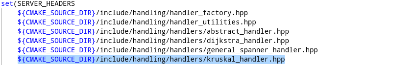
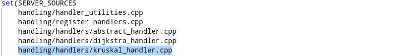
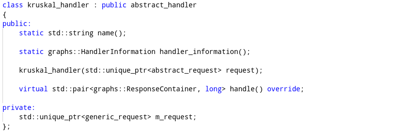
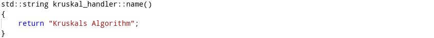
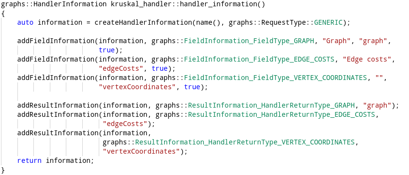
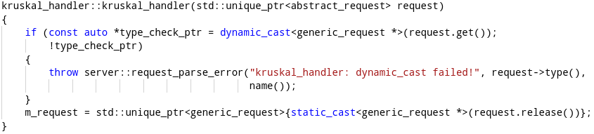
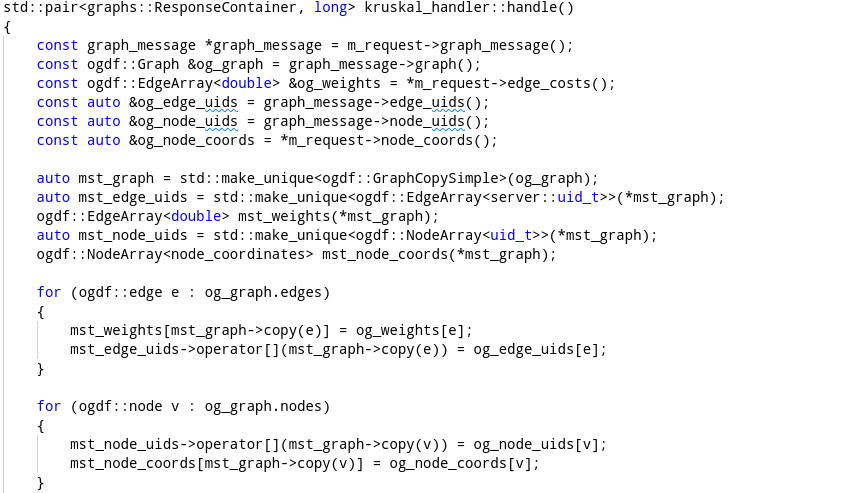
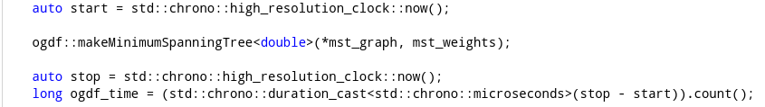
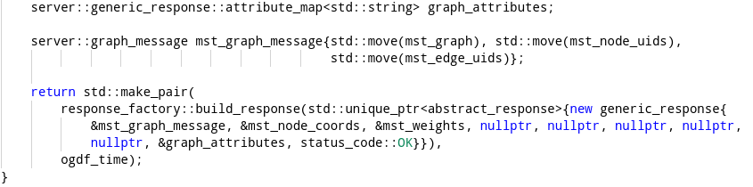

# Generating Your Own Handlers

To execute a graph algorithm on the server, the algorithm needs to be implemented as a so-called _handler_. The backend library provides a C++ interface to easily add _generic handlers_. The following section describes the steps needed to implement a new generic handler and provides an example.

Handlers added the way described here are automatically detected by the S.P.A.N.N.E.R.S.-Plugin upon first connection to a server and can directly be used.

The general steps needed to build a generic handler are the following:


1.  Create a C++ file for the handler (```.hpp``` and, if needed, ```.cpp```) and add it to the ```CMakeLists.txt```
2.  Create a class for the handler
3.  Inherit from ```abstract_handler.hpp```
4.  Implement the static ```name()``` function
5.  Implement the static ```handler_information()``` function
6.  Provide a constructor
7.  Implement the ```handle()``` function
8.  Register the handler in ```register_handlers.cpp```
9.  Recompile the server


## General Steps in Building a Handler

### Creating the Files

The first step in building a handler is to create matching C++ files. Those are a header (```.hpp```) and, if needed, a source file (```.cpp```). By default, handler files can be found in ```include/handling/handlers``` and ```src/handling/handlers```. To add the files to the compilation unit, they must be added to their respective lists ```SERVER_HEADER``` and ```SERVER_SOURCES``` in ```src/CMakeLists.txt```.

### Creating a Class and Inheritance
<!--purely statt pure??-->
During runtime, handlers are objects which are created separately for each request. Every handler is implemented as a class and such a handler class must inherit from the pure virtual class ```abstract_handler.hpp```.

### Implement ```name()```

A function with the signature ```static std::string name()``` must be implemented. This function should output a unique name for the handler. This will be the name shown to the user in the frontend. As explained in [a later section](#register-the-handler), it is discouraged to use ```/``` as a character in this name.

### Implement ```handler_information()```

A handler must provide the client with information about which data is needed to process a request and information about which data will be part of the resulting response. The function ```static graphs::HandlerInformation handler_information()``` creates a so-called _handler information object_. This object consists of fields that indicate which data is needed and which data is part of the answer. In the ```handler_information()``` function, the information object is created with a call to ```createHandlerInformation()```. For a generic handler, the arguments must always be ```name()``` and ```graphs::RequestType::GENERIC```.

Every information that is needed to process a request (including the graph itself) must be set with the ```addFieldInformation()``` function. Its first argument is always the handler information object itself. The second argument specifies the type of the field. This might be the graph itself, information associated with nodes and edges or singular values. A list of possible types can be found in the table below or in the protocol file ```available_handlers.proto``` under ```FieldInformation```.

|Type   |Description  |
| ------------ | ------------- |
| ```BOOL```, ```DOUBLE```, ```CHOICE```, ```INT```, ```LITERAL```, ```STRING```   | Sets a single entry of the type. |
| ```GRAPH```| Activates the graph entry.|
|```EDGE_COST```, ```VERTEX_COST``` | Sets a weight for each edge or node |
|```EDGE_ID```, ```VERTEX_ID``` | Sets a single entry which must be an edge <br /> or node index.|
|```EDGE_ID_ARRAY```, ```VERTEX_ID_ARRAY```|Sets an array of edge or node indices.|
|```VERTEX_COORDINATES```|Activates vertex coordinates.|


The third argument given to ```addFieldInformation()``` is the name of the field displayed in the frontend, the fourth is the unique internal key of the field. Keys that are not for the graph, node coordinates or edge and node weights must start with ```graphAttributes.*```. The last argument indicates whether this field is required or optional for a request. If omitted, the field is optional by default.

The syntax to add to response fields is nearly identical, in this case the function ```addResultInformation()``` is called. Its first argument is, again, the handler information object, its second argument is the type, fourth and fifth are unique name and display name.

### Constructor

The handler must provide a constructor which takes an ```std::unique_ptr<abstract_request>``` as its only argument. This will provide the handler with the request it must answer. The request itself will be processed in the ```handle``` function later. In the constructor, the handler can check whether the request is a correct request for the handler and apply preprocessing as needed.

### Implement ```handle()```

The function ```std::pair<graphs::ResponseContainer, long> handle()``` is called by the server to process the request. It overrides the equivalent pure virtual function of ```abstract_handler```. This function has the purpose to extract the information from the request, call the graph algorithm and then build the response object.

The request consists of a ```graph_message```, which stores the structural information of the graph and of the fields previously set with ```handler_information()```. The ```graph_message``` object is immutable and allows access to the graph and gives an index-based view on this graph. The fields in the ```generic_request``` are accessed through member functions. Some attributes like node coordinates or weights have specialized functions to allow direct access, others must be accessed through attribute maps. A more in-depth list of access functions is provided via the code documentation.

The return type of ```handle()``` is a pair of the response in the form of a ```graphs::ResponseContainer``` and a ```long``` integer. This integer should represent the time in microseconds the graph algorithm itself needed. The ```graphs::ResponseContainer``` is made by the function ```response_factory::build_response```, which takes a ```generic_response```. A ```generic_response``` follows the same logic as a ```generic_request```, it contains a ```graph_message``` and attributes as arrays and maps.


### Register the Handler

A handler first needs to be registered so that the server is able to recognize it. This is done in the file ```src/handling/register_handlers.cpp```. Here, the header of the handler file must be included and the class must be registered in the function ```init_handlers()```. For this, the function ```register_handler()``` is called with the handler class as template argument.

One optional string can be given to ```register_handler()``` as argument. This string is interpreted as a directory structure, where every ```/``` signals a new subdirectory.  In this way, handlers can be sorted in categories to be displayed in the frontend. This also applies to every ```/``` set in the ```name()``` function.

### Recompile the Server

Lastly, for the new handler to be active, the server must be recompiled and restarted.

## Example: Kruskal MST Handler

This section will describe how to add a simple handler for Kruskal's minimum spanning tree algorithm.

The first step is to create ```include/handling/handlers/kruskal_handler.hpp``` and ```src/handling/handlers/kruskal_handler.cpp``` and add them to ```src/CMakeLists.txt```:
<!-- nochmal überlegen, ob man das im Codeblock oder in einem Bild einfügt-->

	set(SERVER_HEADERS
		${CMAKE_SOURCE_DIR}/include/handling/handler_factory.hpp


<center>
<a name = "cmake1">
	
</a>
</center>
    
...
    
<center>
<a name = "cmake2">
	
</a>
</center>


Next, we declare the class ```kruskal_handler``` in ```include/handling/handlers/kruskal_handler.hpp``` as follows:

<center>
<a name = "class">
	
</a>
</center>

The class inherits from ```abstract_handler``` and implements all functions needed for a handler. The private attribute ```m_request``` stores the request given to the constructor for later access.

Now, the functions need to be defined in ```src/handling/handlers/kruskal_handler.cpp```. The first function to implement is ```name()```. 

<center>
<a name = "name">
	
</a>
</center>

The next function should be ```handler_information```. For Kruskal's algorithm, the algorithm only needs the graph itself and edge weights. To represent the solution later, the coordinates of the nodes are also required. The response should send back a tree in the form of a graph, the coordinates to draw the nodes in QGIS and the edge weights of the surviving edges. The resulting function should look like this:

<center>
<a name = "handlerInfo">
	
</a>
</center>

The constructor takes an ```abstract_request``` and tries to cast it into a generic request.

	kruskal_handler::kruskal_handler(std::unique_ptr<abstract_request> request)
	{
		if(const auto *type_check_ptr = dynamic_cast<generic_request *>(request.get());
		{
			throw server::request_parse_error("kruskal_handler: dynamic_cast failed!", request->type(), name());
		}
		m_request = std::unique_ptr<generic_request>{static_cast<generic_request *>(request.release())};
	}


<center>
<a name = "constructor">
	
</a>
</center>

Now, the ```handle()``` function does several things. First, all information needs to be copied into a new graph (because the graph from the request is immutable and the algorithm cuts edges):

<center>
<a name = "handle1">
	
</a>
</center>

Then, the function ```makeMinimumSpanningTree()``` from the OGDF is called and its runtime is measured:

<center>
<a name = "handle2">
	
</a>
</center>

Finally, the result is packed into a response object:

<center>
<a name = "handle3">
	
</a>
</center>

The new handler must then be registered in the function ```init_handlers()``` in ```src/handling/register_handlers.cpp```:

<center>
<a name = "register">
	
</a>
</center>

In the OGDF plugin, the new handler now appears under the category _Minimum Spanning Trees_.

The entire code of this example (and also some other example handlers) is implemented in the backend repository. The files can be found under ```include/handling/handlers/kruskal_handler.hpp``` and ```src/handling/handlers/kruskal_handler.cpp```.

## Specialized Handlers

It is also possible to create specialized handlers for complicated use cases not covered by generic handlers. This, however, would involve changing and expanding server, frontend and protocol code. It is out of the scope of this handbook to provide instructions on this, but the possibility should be noted here.