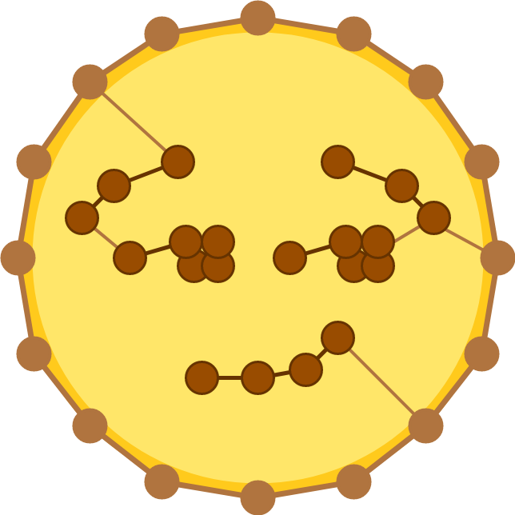

# Welcome to the S.P.A.N.N.E.R.S.-Plugin-Documentation!

We provide a possibility to connect the (open-source) geographic information system [QGIS](https://www.qgis.org/en/site/) with the open graph drawing framework [OGDF](https://ogdf.uos.de/).

Graph algorithm engineers can embed new graph algorithms in the OGDF and test them on real life instances extracted from map data. QGIS enthusiasts can also browse through a range of efficient algorithms already provided in the OGDF and perform various tasks with them.

With our plugin, you can also perform customisable experiments and automatically visualise the results in a scientific manner.
If you want to use the S.P.A.N.N.E.R.S.-Plugin you can either enjoy the easy installation process with our docker image or you can follow our installation guide by manually installing the individual components.

When you're all set, you can start with the [Beginner's Guide](ui.md)<!--change if navigation is changed-->. Later on, you can also check out our guide for [Advanced Applications](handlers.md).

Good luck and have fun! 😏

