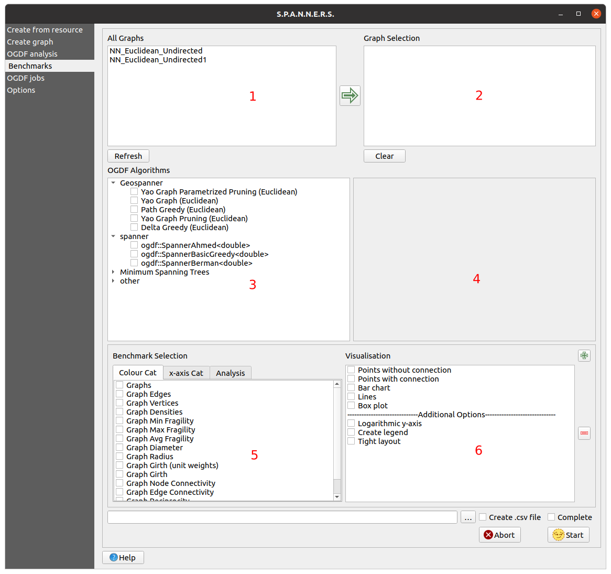

# Testing Your Results

The Benchmark System is represented as a tab in the user interface and gives you the possibility to execute experiments using the graphs you created. Through
multiple calls to the OGDF, you can compare an algorithm's performance on different graphs and compare several algorithms with each other. The system automatically does all the necessary calls and can also create plots, which can showcase the results. This is the UI of the system:

    <a name="benchmarksystem">
        {:target="_blank"}
    </a>

In area 1 you can select any number of graphs currently loaded in QGIS by double-clicking.  
Area 2 shows all the selected graphs. You can remove graphs from this selection by double-clicking the graph in the list. If you want to choose all graphs at once, you can also press the `green arrow`.  In the two areas below you can make all the required selections concerning the OGDF algorithms.  
All algorithms available are listed in area 3 and can be selected directly.  
Area 4 automatically shows all the appropriate parameters for the algorithms.
For every parameter, you can specify a range of values you wish to examine. Furthermore, it's possible to execute every graph with all of its cost functions. For every algorithm, you can define the number of executions, so you can have a look at the average and deviations of different executions with the same parameters.  
Area 5 and 6 regard the visualisation of the results. If you want to create different visualisations/benchmarks of the results, you can press the `+` button, which creates two additional areas below.  
You can make three selections in area 5: First, two parameter selections have to be made.
The first selection is in connection with the colour-coded categorisation of the data. This means the original data set will be divided into multiple independent data sets and for each set a legend entry is created and the second selection defines the structuring of the x-axis. 
The third selection is the analysis, which defines the y-axis of the plot. Note that you can also make multiple selections for the parameters
or no selection for the first parameter. Naturally, the selectable parameters change with the algorithms you selected in area 3.
For example if you choose `Graph` and `Algorithm` for the first parameter selection, the resulting plot breaks down the results by graphs and algorithms. It shows a different colour for all the possible combinations of graphs and algorithms. Of course, it is possible that multiple values exist for one data point in the plot. In this case the system automatically calculates the average over all the values.
The last thing you need to do is to define the type of plot you wish to create in area 6, but you can also choose to create multiple plots for the same data.
In addition you can select some options regarding the design of the plot.

At the bottom of the tab you can specify a path to a folder. If you check the `Create .csv file` checkbox, multiple csv-files will be created and put into this folder. One of these files contains all the executions and values associated with the calls and one file is created for every benchmark visualisation you created, containing all the concrete numbers of the plot.  The name of the file containing all information starts with
`Complete\_Benchmark` and the filenames for the visualisations all start with `BenchmarkResult`. To differentiate the files, the file names end with the date and time of the creation.
