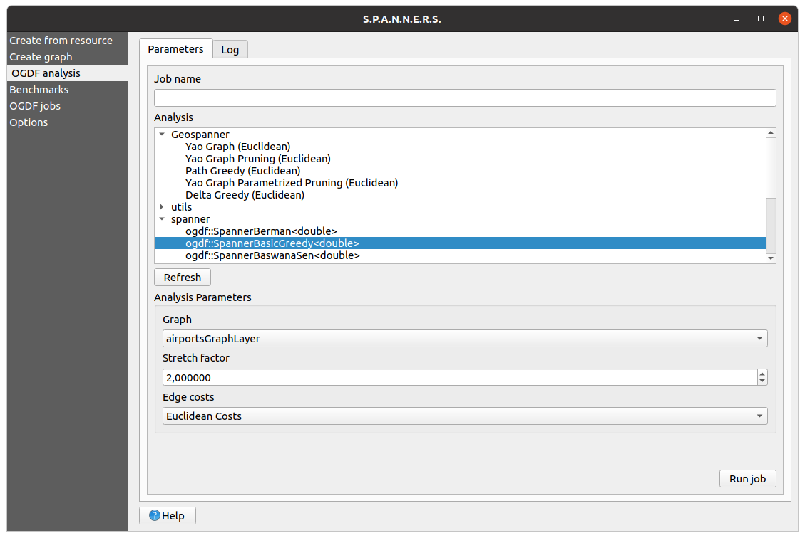
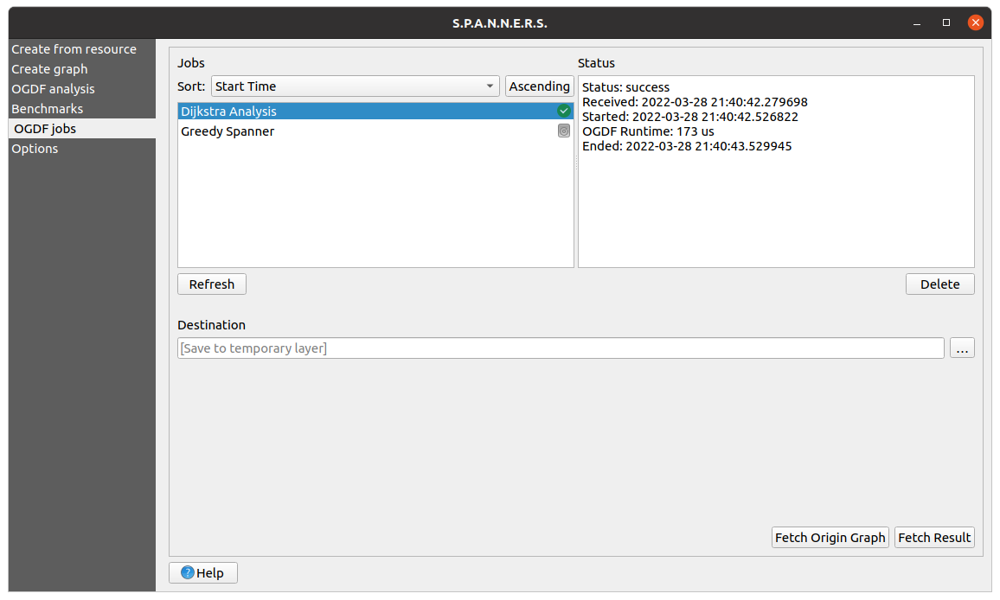
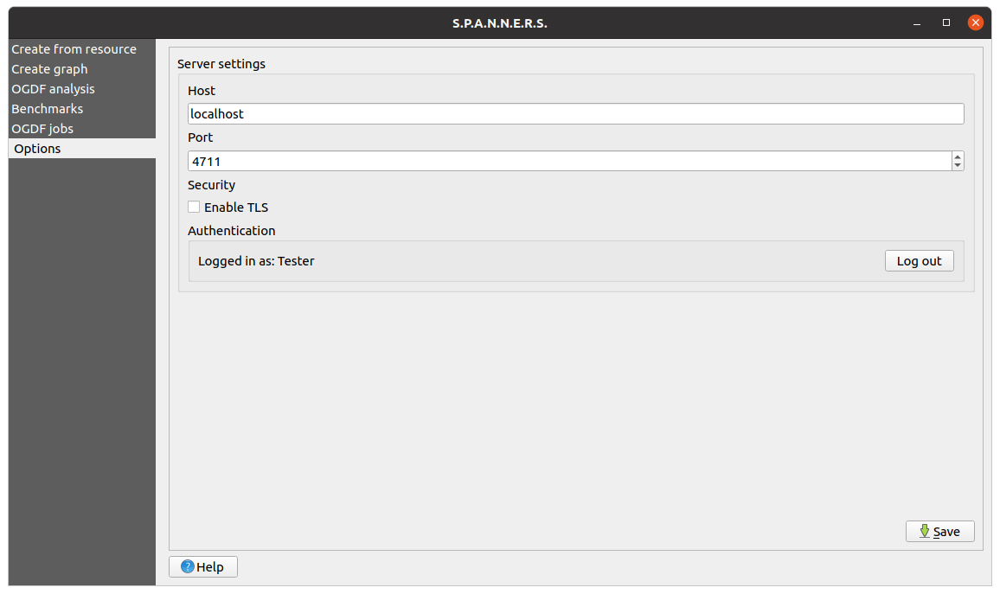

# User Interface

The user interface consists of different windows that provide various functions, such as creating or editing graphs. All functions of the plugin are available through the user interface.

The section [Open Plugin Main Window](#open-plugin-main-window) shows how to open the main window of the plugin and the window of the graph layer. After you know how to open the windows, the components of the main window will be presented in the section [Plugin Window Overview](#plugin-window-overview). For more information on the graph layer, see the chapter on [graph layers](graphlayer.md).

## Open Plugin Main Window
The main window looks like this:

<a name = "mainwindow">
	[](https://project2.informatik.uni-osnabrueck.de/spanners/img/main_window_resource.png){:target="_blank"}
</a>

and can be opened in two different ways:
### Menu Bar
In the menu bar, the window can be opened under ``` Plugins -> OGDF Plugin ```. The menu item has several entries that correspond to the tabs presented in the section [Plugin Window Overview](#plugin-window-overview).

### Plugin Toolbar
Another possibility to open the window is through the _plugin toolbar_ by clicking on the plugin logo or on the arrow next to the logo to directly open a selected tab.

Both options are highlighted in red in the image below:

<a name="openpluginwindow">
    [](https://project2.informatik.uni-osnabrueck.de/spanners/img/open_plugin_window.png){:target="_blank"}
</a>

## Open Graph Layer Window
The following Graph Layer Window can be accessed by simply double-clicking on the desired layer in the layers panel. Alternatively, the window can be opened by right-clicking on the layer in the _layers panel_ and selecting the menu entry ```properties...```.

<center>
    <a name="graphlayerwindow">
        [](https://project2.informatik.uni-osnabrueck.de/spanners/img/graph_layer_window.png){:target="_blank"}
    </a>
</center>

## Plugin Window Overview
The main window provides a navigation on the left hand side. There are multiple tabs inserted which will all be described separately in the following paragraphs. You can navigate to the content of a tab by simply clicking on the desired tab.

### Create From Resource Tab
On the _Create from resource tab_, which is directly chosen when you open the plugin (see the [image above](#mainwindow)), you can load a layer from a predefined data set into the QGIS canvas. This can be done by selecting a data set from the drop-down list and then selecting a storage location of the layer. By clicking the `Create` button, the predefined data set will be created in the selected location and loaded as a layer to be rendered in QGIS. The predefined data sets contain various real open data vector and raster data for testing purposes and are described in the following.

- **airports:** The _airports_ data set contains 3187 large and medium airports around the world represented by point features. Each airport has information about codenames, elevation, frequency, runways and wikipedia links. This data set is in the public domain and can be used, for example, to create a graph from this point layer. More details concerning this data set can be found under [this link](https://hub.arcgis.com/datasets/esri-de-content::world-airports/about).
- **berlin elevation:** The _berlin elevation_ data set contains a digital elevation model of Berlin. The data is stored in the Tag Image File Format (TIFF) and is licensed under the Open Data Commons Open Database License (ODbL). It can be used to build cost functions. More details concerning this data set can be found under [this link](https://www.opendem.info/download_srtm.html).
- **berlin environmental zone:** This data set provides one polygon of the environmental zone of Berlin. The data is licensed under Data licence Germany – attribution – Version 2.0 and can be used, for example, in cost functions of weighted graphs or to simulate forbidden area. More details concerning this data set under [this link](https://hub.arcgis.com/datasets/esri-de-content::umweltzone-berlin/about).
- **berlin streets:** This data set offers a detailed street network of Berlin represented by a line layer with 42568 streets. The streets contain various information such as street name and type. The data is licensed under Data licence Germany – attribution – Version 2.0 and can be used, for example, to create a graph from this line layer. More details concerning this data set can be found under [this link](https://hub.arcgis.com/datasets/esri-de-content::stra%C3%9Fennetz-berlin/about?layer=1).
- **brandenburg nature reserves:** The _brandenburg nature reserves_ data set consists of 621 polygons representing nature reserves in Brandenburg. The data is licensed under Data licence Germany – attribution – Version 2.0 and can be used, for example, in cost functions or to simulate forbidden area. More details concerning this data set can be found under [this link](https://hub.arcgis.com/maps/esri-de-content::schutzgebiete-brandenburg/about).
- **brandenburg water conservation areas:** This data set includes 2040 water conservation areas represented as polygon layers. The data is licensed under Data licence Germany – attribution – Version 2.0 and can be used, for example, in cost functions of weighted graphs. More details concerning this data set can be found under [this link](https://hub.arcgis.com/datasets/esri-de-content::wasserschutzgebiete-brandenburg/about).

### Create Graph Tab
The _Create graph tab_ shown below allows to create graphs from one input layer or a `.graphml` file. Since there exist many input options, the creation of the graph is more complex and is explained in detail in the [Graph Builder section](graphbuilder.md).

<a name="creategraph">
    [](https://project2.informatik.uni-osnabrueck.de/spanners/img/Plugin_CreateGraph.png){:target="_blank"}
</a>

The contents of the tab are split into different tabs that provide various functions. The _Parameters tab_ contains all the input fields for creating a graph, which is created after clicking the `Create` button. The _Graph Tasks tab_ displays a table that lists information about all running and completed graph creation processes and allows to cancel a process. Also, it is possible to create at most three graphs simultaneously in the background by clicking the `Create` button several times. The _Log tab_ outputs logging information in a text browser.

### OGDF Analysis Tab
After you have created a graph, you can send it to the OGDF server for analysis in the _OGDF analysis tab_ and fetch the result of the analysis in the _OGDF jobs tab_. As you can see below, the view has two tabs.

<a name="graphlayerwindow">
    [](https://project2.informatik.uni-osnabrueck.de/spanners/img/main_window_analysis.png){:target="_blank"}
</a>

On the _Parameters tab_ you can specify the analysis and the corresponding analysis parameters. The _Log tab_ provides logging information. After clicking the `Run job` button, your data will be sent to the server, where the analysis will be performed. As explained in the chapter on [generating your own handlers](handlers.md), analyses can be added. This tab provides several analyses by default. The analysis categories and some important analyses are described below:

- __Spanner:__ The spanner category includes spanner algorithms that preserve the distances of all nodes in the graph up to a certain additive or multiplicative factor. The factor is typically called stretch factor. The provided algorithms guarantee different spanner characteristic like fault-tolerance, minimum cost and roundtrip.
- __Geospanner:__ The geospanner category comprises spanner algorithms that leverage the characteristics of the metric space to increase the calculation speed. Geospanner algorithms can be seen as a special case of spanner algorithms. These algorithms only use the nodes of the graph and imply a complete graph due to the metric space.
- __Utils__: The utils category contains analyses for calculating specific graph characteristics, such as the fragility or the girth of a graph.
- __Greedy Spanner:__ The greedy spanner analysis calculates a \((2k-1)\)-spanner of a given graph using the basic greedy \((2k-1)\)-spanner algorithm by Althöfer et al., 2007. The multiplicative spanner is constructed by greedily adding edges. The algorithm takes an undirected weighted graph, its edge costs and a stretch factor \(\geq 1\) for the multiplicative distortion function as input.
- __Berman Spanner:__ The Berman spanner analysis calculates a \(k\)-spanner with an approximation ratio of \(\mathcal{O}(n^{1/2}\log n)\) based on Berman et. al., 2013. The analysis takes a simple connected graph, the edge costs of the graph and a stretch factor \(\geq 1\) for the multiplicative distortion function as input.
- __Dijkstra:__ The Dijkstra analysis performs Dijkstra's single source shortest path algorithm on the given graph. The analysis takes a graph with positive edge weights, the graph's edge costs and a start node as input. The resulting graph contains all shortest paths starting from the start node.
- __Kruskal's Algorithm:__ This analysis uses Kruskal's algorithm to find the minimum spanning tree of a given graph.
- __Simplification:__ The simplification analysis simplifies a given graph by removing degree two nodes and adding an edge between their two adjacent nodes.


### Benchmarks Tab
The Benchmark System gives you the possibility to execute experiments using the graphs you created. For more details, see the [Testing Your Results chapter](testing.md).

### OGDF Jobs Tab
As mentioned above, in the _OGDF jobs tab_ you can view the status of your running jobs and fetch the results of your successfully completed jobs from the server. In addition, you can abort jobs, delete them and fetch the original graph of the analysis from the server. The tab is displayed below:

<center>
    [](https://project2.informatik.uni-osnabrueck.de/spanners/img/main_window_jobs.png){:target="_blank"}
</center>

### Options tab
The _Options tab_ is shown below and allows you to specify general settings for the plugin. You can specify server settings, like host or port and authentication settings. In the authentication settings, you can create a new user on the server or log in to the server by specifying a username and a password. After confirming the `Save` button, the settings will be persistently saved in QGIS. The following server settings can be set:

<center>
    [](https://project2.informatik.uni-osnabrueck.de/spanners/img/main_window_options.png){:target="blank"}
</center>


- __Host:__ Specifies the host address of the server. The default value is `localhost`
- __Port:__ Contains the port number of the server. The default number is `4711`.
- __Username:__ The username is used to identify yourself to the server.
- __Password:__ The password to access the server.
